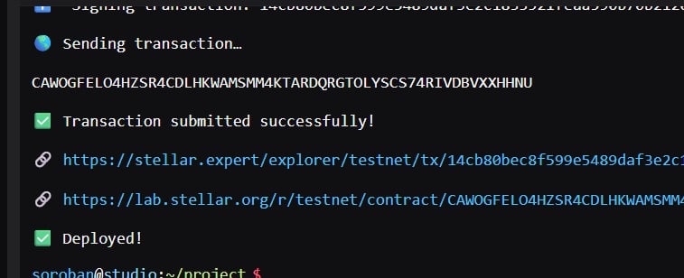

# Title
Trustless SplitPay

# Description
A decentralized group expense settlement application built on Stellar Soroban. It enables users to create shared bills, track participant payments, and automatically settle funds through smart contracts without relying on a trusted intermediary.

# Vision
To provide a transparent, secure, and trustless way for friends, teams, and organizations to manage shared expenses while eliminating manual tracking and payment disputes.

# Features
- `create_bill`: Create a new shared bill with participants and predefined payment shares.
- `pay_bill`: Allow participants to contribute their portion directly to the smart contract.
- `claim_bill`: Enable the bill creator to withdraw the collected funds once the bill is fully paid.
- `cancel_bill`: Cancel an unpaid bill before completion.
- `get_bill`: Retrieve bill details, payment progress, and current status.
- Event logging for bill creation, payments, claims, and cancellations.

# Contract
Contract ID: CAWOGFELO4HZSR4CDLHKWAMSMM4KTARDQRGTOLYSCS74RIVDBVXXHHNU

Link: https://stellar.expert/explorer/testnet/contract/CAWOGFELO4HZSR4CDLHKWAMSMM4KTARDQRGTOLYSCS74RIVDBVXXHHNU

Contract's screenshots:

# Future scopes
- Support percentage-based expense splitting.
- Add custom split amounts for each participant.
- Implement recurring bills for subscriptions and monthly expenses.
- Integrate Stellar wallet authentication and user profiles.
- Build a web-based dashboard using Next.js and Soroban SDK.
- Support multiple Stellar assets and stablecoins.
- Add notification and reminder systems for unpaid participants.
- Generate payment history and expense analytics.

# Contract Address
CAWOGFELO4HZSR4CDLHKWAMSMM4KTARDQRGTOLYSCS74RIVDBVXXHHNU

# Profile

Skills: Rust, Soroban Smart Contracts, Stellar Blockchain, Next.js, TypeScript.
